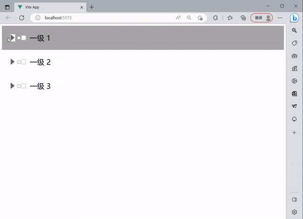

## 使用Vue2封装Tree组件

### 一、介绍



​		Tree组件实现，原理就是递归，数据是递归的，所以组件也是递归，将数据一层一层的渲染，简易结构如下

```vue
<template>
  <div class="main">
    <div v-if="data" v-for="(item, index) in data">
        <input type="checkbox" ref="parent" @click="updateDisplay($event, index)" :id="item.id"><label :for="item.id">
          {{ item.label }}</label>
      </div>
      <Tree v-if="item.children" ref="child" :data-index="index" :data="item.children" class="child" />
    </div>
  </div>
</template>
<script>
export default {
  name: 'Tree',
  props: {
    data: {
      type: Array
    }
  }
}
</script>
<style scoped lang='less'>
@import url('./reset.css');
</style>
```

1. 组件接收一个父组件的data，将自己作为子组件传入 item.children

2. 当点击input （checkbox）时，要获取当前input 使得点击他时他所有的子节点都要被选中所有要给子组件Tree添加ref=“child”，或者被取消，父节点要根据子节点的被选中数量来判断是否为选中，还是半选中状态给 input添加ref="parent"。

3. 由于渲染是一层一层渲染 ，第一次渲染时会获取父组件input时最外层的所有input，所以需要给子组件添加自定义属性:data-index=“index”利用父组件的索引，找到自己真正的父节点

   例如：如果最外层有两个数据 那么就会递归渲染出2次 input 和一个2个Tree子组件

   ```vue
   <template>
     <div class="main">
       <div v-if="data" v-for="(item, index) in data">
           <input type="checkbox" ref="parent" @click="updateDisplay($event, index)" :id="item.id"><label :for="item.id">
             {{ item.label }}</label>
         </div>
         <Tree v-if="item.children" ref="child" :data-index="index" :data="item.children" class="child" />
       </div>
     </div>
   <template>
     <div class="main">
       <div v-if="data" v-for="(item, index) in data">
           <input type="checkbox" ref="parent" @click="updateDisplay($event, index)" :id="item.id"><label :for="item.id">
             {{ item.label }}</label>
         </div>
         <Tree v-if="item.children" ref="child" :data-index="index" :data="item.children" class="child" />
       </div>
     </div>
   </template>
   </template>
   <script>
   export default {
     name: 'Tree',
     props: {
       data: {
         type: Array
       }
     }
   }
   </script>
   <style scoped lang='less'>
   @import url('./reset.css');
   </style>
   ```

   

### 二、组件代码

#### 1.改变input复选框的样式，Tree/reset.css

```css
input[type="checkbox"]:checked {
  box-shadow: 0 0 0 3px hotpink;
  border:hotpink ;
}
:root {
  --dark: #24d3d3;
}
/* input[type="checkbox"]{
  display: none;
} */
label {
  display: flex;
  align-items: center;
  grid-gap: 16px;
  cursor: pointer;
}
label .checkbox {
  width: 20px;
  height: 20px;
  background: #ccc;
  border-radius: 4px;
  position: relative;
  transition: .2s ease;
  transition-delay: .2s;
}
label .checkbox::before {
  content: '';
  position: absolute;
  top: 2px;
  left: 2px;
  right: 2px;
  bottom: 2px;
  background: #fff;
  border-radius: 2.5px;
  transition: .2s ease;
  transition-delay: .2s;
}
input:checked + label .checkbox::before {
  top: 10px;
  left: 10px;
  right: 10px;
  bottom: 10px;
  border-radius: 50%;
  transition-delay: 0s;
}
input:checked + label .checkbox {
  background:#24d3d3;
  transition-delay: 0s;
}
label .checkbox .check {
  display: block;
  width: 12px;
  height: 6px;
  position: absolute;
  top: 6px;
  left: 50%;
  transform: translateX(-50%) rotateZ(-45deg);
}
label .checkbox .check::before {
  content: '';
  position: absolute;
  top: 0;
  left: 0;
  width: 2px;
  height: 0;
  background: #fff;
  transition: .2s ease;
  transition-delay: .2s;
}
label .checkbox .check::after {
  content: '';
  position: absolute;
  bottom: 0;
  left: 0;
  width: 0;
  height: 2px;
  background: #fff;
  transition: .2s ease;
  transition-delay: 0s;
}
input:checked + label .checkbox .check::before {
  height: 100%;
  transition-delay: .2s;
}
input:checked + label .checkbox .check::after {
  width: 100%;
  transition-delay: .4s;
}

```


#### 2.组件Vue文件，Tree/index.vue  

注意：背景图找一个向右的一个箭头

```vue
<template>
  <!-- 可以绑定style  :style="cssVals"-->
  <div class="main">
    <div v-if="data" v-for="(item, index) in data">
      <div class="container">
        <span class="switch" @click="switch_($event, index)" v-if="item.children"></span>
        <span v-else style="width: 30px;"> </span>
        <input type="checkbox" ref="parent" @click="updateDisplay($event, index)" :id="item.id"><label :for="item.id">
          <span class="checkbox">
            <span class="check"></span>
          </span>
          {{ item.label }}</label>
      </div>
      <Tree v-if="item.children" ref="child" :data-index="index" :data="item.children" class="child" />
    </div>
  </div>
</template>
<script>
export default {
  name: 'Tree',
  props: {
    data: {
      type: Array
    }
  },
  data() {
    return {
      //使用传递父组件传递来的数据
      prop: this.data,
      currentAll: []
    }
  },
  methods: {
    //展开和关闭第一层子选项
    switch_(e, index) {
      const classLists = e.srcElement.classList
      const childsClassLists = this.$refs.child[index].$el.classList
      if (classLists.length > 1) {
        classLists.remove('open_close')
        childsClassLists.remove('child_open_close')
      } else {
        classLists.add('open_close')
        childsClassLists.add('child_open_close')
      }
    },
    //获取勾选选项实现联动Tree联动
    updateDisplay(e, index) {
      //当前节点联动子节点
      const current = e.target
      const currentParentI = this.$el.getAttribute('data-index')//子组件传入了自定义属性父节点的索引index，找到父节点
      if (this.prop[index].children) {
        let currentChilds = this.$refs.child[index].$el.querySelectorAll('input')//当前节点的所有
        for (const item of currentChilds) {
          if (current.checked) {
            item.checked = true
          } else {
            item.checked = false
          }
        }
      }
      //递归联动父节点-根节点
      this.getParents(this)
    },
    //递归获取当前当前节点的所有父级节点
    getParents(that) {
      if (that.$parent.prop) {
        const currentParentI = that.$el.getAttribute('data-index')//子组件传入了自定义属性父节点的索引index，找到父节点
        const currentAll = that.$el.querySelectorAll('input')//获取当前根节点的所有节点
        const currentParent =that.$parent.$refs.parent[currentParentI]
        if (this.$parent.prop) {
          const Arr = []
          for (const item of currentAll) {
            Arr.push(item.checked)
          }
          if (Arr.every(value => value === false)) {
            currentParent.checked = false
            currentParent.indeterminate = false;
          } else if (Arr.every(value => value === true)) {
            currentParent.checked = true
            currentParent.indeterminate = false;
          } else {
            currentParent.checked = false;
            currentParent.indeterminate = true;
          }
        }
        this.getParents(that.$parent)
      }
    }
  }
}
</script>
<style scoped lang='less'>
@import url('./reset.css');
.container {
  display: flex;
  align-items: center;
  // justify-content:center;
  font-size: 30px;
  padding: 30px;
  &:hover {
    background: #a5a5a5;
  }
  .switch {
    width: 30px;
    height: 30px;
    background-image: url('自己找一张图');
    background-repeat: no-repeat;
    background-size: contain;
    background-position: center center;
  }
  .open_close {
    transform: rotate(90deg);
  }
}
.child {
  display: none;
  padding-left: 30px;
}
.child_open_close {
  display: block;
}
</style>
```

### 3.使用

* 将树形结构测试数据data写入data.js

```js
export const data =  [{
  id: 1,
  label: '一级 1',
  children: [{
    id: 4,
    label: '二级 1-1',
    children: [{
      id: 10,
      label: '三级 1-1-1'
    }, {
      id: 11,
      label: '三级 1-1-2'
    }]
  },
  {
    id: 5,
    label: '二级 1-2',
  }
]
}, {
  id: 2,
  label: '一级 2',
  children: [{
    id: 6,
    label: '二级 2-1'
  }, {
    id: 7,
    label: '二级 2-2'
  }]
}, {
  id: 3,
  label: '一级 3',
  children: [{
    id: 8,
    label: '二级 3-1'
  }, {
    id: 9,
    label: '二级 3-2'
  }]
}]
```


* 在想要使用Tree组件的index.vue中

```vue
<template>
  <div >
      <Tree :data="data"/>
  </div>
</template>
<script>
import Tree from '../Tree/index.vue'
import {data} from './data.js'
export default{
  name: 'Index',
  data() {
    return {
      data:data
    }
  },
  components:{
    Tree
  }
}
</script>
<style scoped lang='less'>

</style>
```

### 4.git地址：https://github.com/gittwl/twl_-.git